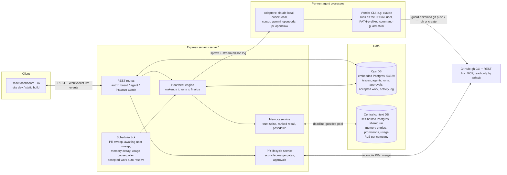
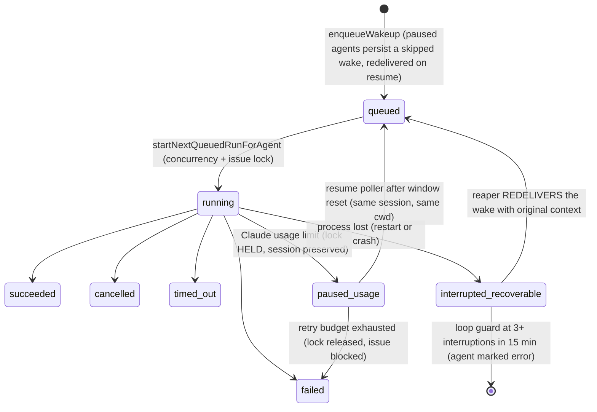
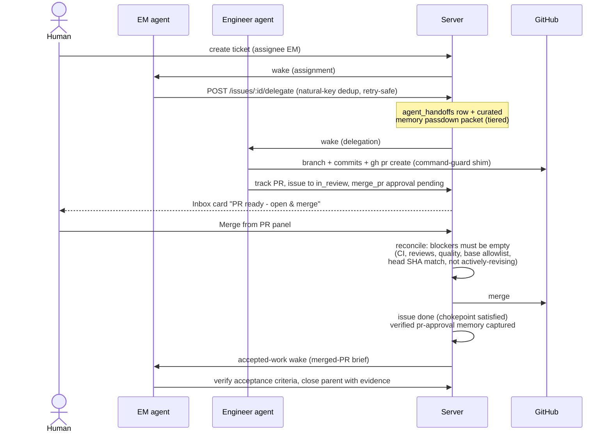
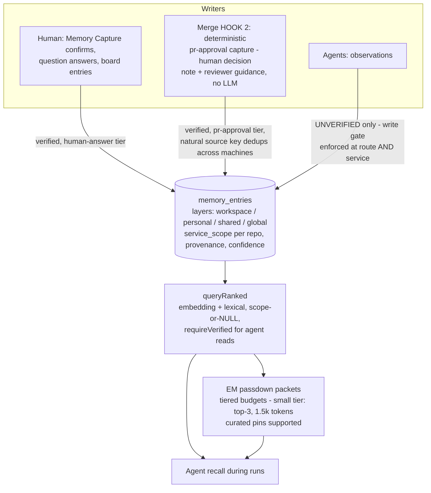

# ADE (Combyne) — Architecture

Status: Engineering reference · Last updated: 2026-06-12 (post E2E engagement — every flow below was exercised live; see `logs/e2e-run-2026-06-10/FINAL_REPORT.md`)

ADE is an orchestration platform where AI agents work real tickets like a software team: a coordinator (EM) triages and delegates, engineers implement and raise PRs, a human merges, and the accepted decision is captured into a shared team memory that future work recalls. Agents are not resident processes — they run in short, observable **heartbeat runs** spawned through pluggable CLI adapters.

## 1. System overview

**Monorepo layout** (pnpm workspaces): `server/` (Express + Drizzle), `ui/` (React), `cli/`, `packages/db` (schema + migrations for the ops DB), `packages/shared` (types, validators, constants), `packages/adapter-utils` (shared adapter machinery incl. the command-guard shim), `packages/adapters/*` (one per vendor CLI), `packages/plugins/*`.

**Two databases, deliberately split.** The **ops DB** is per-instance (embedded Postgres, port 54329) and holds everything operational. The **central context DB** ("the rail") is shared across the team's machines and holds only the memory layer; instances join a team via the onboarding flow and adopt its company + rail. Cross-database foreign keys are impossible, so edges between the two are **logical references only** (migrations 0053 + 0062). Rail access goes through one pooled client wrapped in a client-side deadline (`COMBYNE_CONTEXT_CLIENT_DEADLINE_MS`, default 20s) that evicts the pool on timeout — a blackholed socket fails fast instead of hanging runs, and the UI shows a global "shared rail unreachable" banner from the cached health surface.

## 2. Agent runtime — the heartbeat lifecycle

Agents run only inside heartbeat runs. A **wakeup request** (timer / assignment / on-demand / automation) becomes a **run**; the run spawns the adapter CLI with a context preamble (issue, comments, memory passdown), streams its output to an ndjson log, and finalizes into a terminal state with usage/cost accounting.

Recovery is layered: **boot** resets agents stranded `running` by a dead process, recovers usage-pause windows, then runs the orphan reaper; the **reaper** (periodic) re-delivers recoverable interruptions and hard-caps wall-clock runaways (60 min); the **usage-pause engine** (`COMBYNE_USAGE_PAUSE_ENABLED`) parks runs on Claude subscription limits and auto-resumes the *exact* conversation when the window resets; **max-turns continuation** (`COMBYNE_MAX_TURNS_CONTINUATION_ENABLED`) re-enqueues a warm continuation when a run exhausts its turn budget mid-task with git-measured progress.

## 3. Ticket and PR lifecycle — human-gated merges

The merge is the **one human gate** and several mechanisms defend it:

- **Reconcile-computed blockers** gate `merge()`: PR open + not draft, base branch in the per-workspace allowlist (default branch always allowed), head SHA matches the approval, CI passed (or `unknown` with the explicit env opt-out), no changes-requested review, quality gate, and — while the tracked issue is back `in_progress` — an *"assignee is actively revising"* blocker that clears when the agent returns it to review. Merge-gating blockers are kept out of `agentBlockers` so they never trigger feedback wakes.
- **Close chokepoint** (`issueService.update`): a non-human `done`-transition is refused while a tracked PR is still open (system comment + activity entry). A successful run whose artifact is an open tracked PR hands the issue to `in_review` rather than closing past the gate. Every unattributed status change is stamped into the activity log.
- **External merges** (done directly on GitHub) are detected by the PR sweep (`COMBYNE_PR_SWEEP_INTERVAL_MS`), which runs the same close-out: issue done, approvals batch-resolved (skipping approvals attached to other still-open PRs), EM woken, memory captured.
- **Feedback loop**: changes-requested reviews are held for the human by default; "Let agents fix" dispatches the feedback to the assignee (round-capped under autopilot), the issue returns to `in_progress` (which engages the revising gate), and the next push returns it to review.

## 4. Memory — the trust spine and recall

The rail's value is *what the code can't say*: decisions, conventions, gotchas. Its integrity rests on one rule — **agents can never author verified facts**.

- **Layers and scoping**: `workspace` (company-wide work memory), `personal` (per-owner), `shared` (promotion-gated), `global` (instance-wide, admin-gated, read-only cross-team). `service_scope` pins an entry to a repo; scoped recall returns that repo's entries **plus** company-wide (`NULL`-scope) entries. RLS isolates companies on the shared rail; a pin fence rejects off-tenant writes before they reach it.
- **Retrieval is server-side and model-independent** — Sonnet/Opus/Codex agents receive identical packets. Agent-facing reads are filtered `requireVerified`, so an unverified agent claim can never be read back as fact. Seeded-corpus probe accuracy: 16/16 top-3 through the production route.
- **Capture durability**: high-value captures that fail on a rail outage enqueue to a local outbox for replay. The **accepted-work inbox** (merged PRs pending memory decision) auto-resolves once the pr-approval capture exists (1h EM-grace window), so the Memory page's pending queue reflects real work only.

## 5. Guardrails — what agents can and cannot do

| Surface | Enforcement |
|---|---|
| Merge PRs | Off for agents by default. Gated at REST, at `merge()`, and in the per-run CLI shim — the shim's merge block is lifted only by an explicit `canMergePr=true` capability |
| Push / raise PR | Per-company capability toggles (Integrations → Agent Capabilities), enforced at REST + the command-guard shim (`git push`, `gh pr create` blocks) + the push-remote allowlist (`COMBYNE_ALLOWED_PUSH_REMOTE_PATTERNS`, derived from project repos by default) |
| Jira writes | Read-only by default (`COMBYNE_JIRA_AGENT_READONLY`); per-capability MCP tool-group disallow lists (comment / transition / create) |
| Close tickets | Agents/system cannot close an issue with an open tracked PR (chokepoint); coordinator-owned medium/large issues require completed children + verification evidence |
| Verified memory | Board principals only; agent writes stripped to unverified at route and service layers |
| Board mutations | Trusted-origin check; agent API keys are company-scoped; cross-company access fails closed |

The command-guard shim (`packages/adapter-utils/src/command-guard.ts`) is shared by adapters: a PATH-prefixed directory of `git`/`gh` wrappers generated per run from the agent's effective capabilities (`COMBYNE_GH_CAN_*` env), so the policy holds even inside the vendor CLI's own shell.

## 6. Scheduler — periodic safety nets

| Sweep | Cadence (default) | Job |
|---|---|---|
| PR sweep | `COMBYNE_PR_SWEEP_INTERVAL_MS` (5 min; 60s in dev) | Reconcile open tracked PRs, detect external merges + closed-unmerged PRs, dispatch held feedback, backstop merged-but-open issues, auto-resolve captured accepted-work items |
| Orphan reaper | periodic + boot | Recover lost runs (re-deliver), hard-cap runaways, respect healthy usage-pause windows |
| Usage-pause poller | 60s | Resume parked runs whose provider window reset (earliest reset first, capped backoff, retry budget) |
| Awaiting-user sweeper | 30 min | Close tickets stuck `awaiting_user` (7d); idle-parked **terminal-session** issues expire on their own short window (`TERMINAL_AWAITING_AUTOCLOSE_HOURS`, 8h) |
| Memory decay | periodic | Confidence decay / TTL hygiene on the rail |

Every sweep that mutates state emits an activity event — the UI's live-update provider invalidates the affected queries, so swept changes appear without a reload, and every system transition is attributable in the Activity page.

## 7. Observability

- **Run pages**: persisted ndjson logs (streamed live over WebSocket, polled as fallback), transcripts, invocation payloads (adapter, cwd, command), usage/cost per run. Never-spawned runs state why.
- **Activity log**: every status transition (human, agent, or system) is attributed; system actors are named (`issue-service`, `awaiting-user-sweeper`, `usage-pause-engine`, `issue-pr-reconcile`).
- **Health surfaces**: `/api/health` (adapters, DB, bootstrap), `/api/instance/context-database` (rail status, entry count), `/api/instance/context-database/health` (cheap cached rail health → global UI banner).
- **Inbox**: approvals needing action (incl. ready-to-merge PR cards with deep links), awaiting-your-input issues, failed runs, join requests — backed by the sidebar badge counts.

## 8. Environment

The server reads `~/.combyne/instances/<id>/.env` (NOT a repo-root `.env`; process env wins). The full table lives in `DEVELOPER_SETUP.md`; the load-bearing flags: `COMBYNE_CONTEXT_DATABASE_URL` (join the team rail), `COMBYNE_USAGE_PAUSE_ENABLED=true`, `COMBYNE_MAX_TURNS_CONTINUATION_ENABLED=true`, `COMBYNE_ALLOWED_PUSH_REMOTE_PATTERNS`. Agents inherit the **local user's** CLI auth (e.g. `claude` login) — each dev machine burns its own seat, and usage-pause parks/resumes per machine.

## Related docs

`DEVELOPER_SETUP.md` (one-page setup) · `REPO_ONBOARDING.md` (adding a repo for agent work) · `agents-runtime.md` (operator-level runtime guide) · `AUDIT_PLAYBOOK.md` (audit coverage classes) · `logs/e2e-run-2026-06-10/FINAL_REPORT.md` (live validation evidence)
